# 📋 BIỂU ĐỒ USECASE TỔNG QUÁT - HỆ THỐNG MIKO HOTEL

## 🎭 ACTORS (Tác nhân)

1. **Customer** - Khách hàng (Người dùng đặt phòng)
2. **Staff** - Nhân viên khách sạn (Xử lý bookings, hỗ trợ khách hàng)
3. **Admin** - Quản trị viên (Quản lý toàn bộ hệ thống)
4. **System** - Hệ thống (Xử lý tự động: email, notifications, payment processing, AI gợi ý)

---

## 📊 BIỂU ĐỒ USECASE TỔNG QUÁT

```mermaid
graph TB
    %% Actors
    subgraph Actors[" "]
        Customer["👤 Customer"]
        Staff["👨‍💼 Staff"]
        Admin["👑 Admin"]
        System["⚙️ System"]
    end

    %% Auth
    subgraph Auth["🔐 AuthN/AuthZ"]
        A1["UC1 Đăng ký"]
        A2["UC2 Đăng nhập"]
        A3["UC3 Đăng xuất"]
        A4["UC4 Hồ sơ cá nhân"]
        A5["UC5 Đổi mật khẩu"]
        A6["UC6 Quản lý users (admin)"]
        A7["UC7 Khóa/Mở khóa (admin)"]
        A8["UC8 Phân quyền (admin)"]
        A9["UC9A Xác thực email"]
        A10["UC9B OTP quên mật khẩu"]
    end

    %% Rooms
    subgraph Rooms["🏠 Rooms"]
        R1["UC9 Xem DS phòng"]
        R2["UC10 Tìm kiếm phòng"]
        R3["UC11 Xem chi tiết phòng"]
        R4["UC12 Xem loại phòng"]
        R5["UC13 Quản lý phòng (admin)"]
        R6["UC14 Quản lý loại phòng (admin)"]
        R7["UC15 Cập nhật trạng thái (admin)"]
    end

    %% Bookings
    subgraph Bookings["📅 Bookings"]
        B1["UC16 Đặt phòng cá nhân (cust)"]
        B2["UC17 Đặt phòng nhóm (cust)"]
        B3["UC18 Xem booking của tôi (cust)"]
        B4["UC19 Hủy đặt phòng (cust)"]
        B5["UC19A Duyệt hủy (staff/admin)"]
        B6["UC20 DS bookings (staff/admin)"]
        B7["UC21 Chi tiết booking (staff/admin)"]
        B8["UC22 Cập nhật trạng thái (staff/admin)"]
        B9["UC23 Check-in (staff/admin)"]
        B10["UC24 Check-out (staff/admin)"]
        B11["UC25 Gia hạn check-out (staff/admin)"]
        B12["UC26 Duyệt đoàn (staff/admin)"]
        B13["UC27 Báo giá đoàn (staff/admin)"]
        B14["UC28 Quản lý thông tin khách (staff/admin)"]
    end

    %% Payments & Invoices
    subgraph Payments["💳 Payments & Invoices"]
        P1["UC29 Stripe checkout (cust)"]
        P2["UC30 Tiền mặt (staff/admin)"]
        P3["UC31 Chuyển khoản (staff/admin)"]
        P4["UC32 Lịch sử thanh toán (cust)"]
        P5["UC33 Quản lý payments (staff/admin)"]
        P6["UC33B Cập nhật trạng thái payment"]
        P7["UC33C Thống kê payment"]
        P8["UC33D Đồng bộ payment↔booking"]
        P9["UC33E Payment theo booking/khách"]
        P10["UC34 Hoàn tiền (admin)"]
        P11["UC35 Hóa đơn PDF (cust)"]
        P12["UC35A Gửi hóa đơn email (system)"]
        P13["UC36 Tạo hóa đơn (staff/admin)"]
        P14["UC37 Xem hóa đơn (cust/staff/admin)"]
    end

    %% Services
    subgraph Services["🛎️ Services"]
        S1["UC38 DS dịch vụ (cust)"]
        S2["UC39 Chi tiết dịch vụ (cust)"]
        S3["UC40 Đặt dịch vụ (cust)"]
        S4["UC41 Xem đặt dịch vụ của tôi (cust)"]
        S5["UC42 Quản lý dịch vụ (admin)"]
        S6["UC43 Quản lý đặt dịch vụ (staff/admin)"]
        S7["UC43A Cập nhật trạng thái dịch vụ"]
        S8["UC43B Hủy đặt dịch vụ"]
        S9["UC43C Hạch toán vào hóa đơn"]
    end

    %% Chat
    subgraph Chat["💬 Chat & Realtime"]
        C1["UC49 Chat với staff (cust)"]
        C2["UC50 Lịch sử chat"]
        C3["UC51 Gửi tin nhắn"]
        C4["UC52 Realtime Socket.IO"]
        C5["UC53 Quản lý hội thoại"]
        C6["UC53A Đánh dấu đã đọc"]
        C7["UC53B Đếm chưa đọc"]
        C8["UC53C Chat theo booking (context)"]
    end

    %% Notifications
    subgraph Notif["🔔 Notifications"]
        N1["UC54 Xem thông báo"]
        N2["UC54A Đếm chưa đọc"]
        N3["UC55 Đánh dấu đã đọc"]
        N4["UC56 Gửi thông báo (staff/admin)"]
        N5["UC56A Thông báo hệ thống (auto)"]
        N6["UC56B Realtime + fallback polling"]
        N7["UC56C Cấu hình kênh/ưu tiên (admin)"]
        N8["UC57 Quản trị thông báo (admin)"]
    end

    %% AI
    subgraph AI["🤖 AI Assistant"]
        I1["UC59A Gợi ý phòng/dịch vụ (cust)"]
        I2["UC59B Gợi ý phản hồi chat (staff)"]
        I3["UC59C Gợi ý tác nghiệp (staff)"]
        I4["UC59D Quản trị AI & dữ liệu (admin)"]
    end

    %% System
    subgraph SystemAuto["⚙️ System & Integrations"]
        T1["UC68 Email verify"]
        T2["UC68A Email OTP reset"]
        T3["UC68B Email xác nhận reset"]
        T4["UC69 Email hóa đơn"]
        T5["UC70 Notify booking"]
        T6["UC70A Notify payment"]
        T7["UC70B Notify đặt đoàn"]
        T8["UC71 Stripe webhook/idempotent"]
        T9["UC72 Auto cập nhật trạng thái"]
        T10["UC72A Scheduler/cleanup"]
    end

    %% Links (high-level)
    Customer --> A1 & A2 & A3 & A4 & A5
    Customer --> R1 & R2 & R3 & R4
    Customer --> B1 & B2 & B3 & B4
    Customer --> P1 & P4 & P11
    Customer --> S1 & S2 & S3 & S4
    Customer --> C1 & C2 & C3 & C4
    Customer --> N1 & N2 & N3

    Staff --> A2 & A3 & A4 & A5
    Staff --> R1 & R2 & R3 & R4
    Staff --> B6 & B7 & B8 & B9 & B10 & B11 & B12 & B13 & B14 & B5
    Staff --> P2 & P3 & P5 & P6 & P7 & P8 & P9
    Staff --> S6 & S7 & S8 & S9
    Staff --> C2 & C3 & C4 & C5 & C6 & C7 & C8
    Staff --> N1 & N2 & N3 & N4 & N5 & N6
    Staff --> I2 & I3

    Admin --> A2 & A3 & A4 & A5 & A6 & A7 & A8
    Admin --> R5 & R6 & R7
    Admin --> B6 & B7 & B8 & B9 & B10 & B11 & B12 & B13 & B14
    Admin --> P2 & P3 & P5 & P6 & P7 & P8 & P9 & P10 & P12 & P13 & P14
    Admin --> S5 & S6 & S7 & S8 & S9
    Admin --> C2 & C3 & C4 & C5
    Admin --> N4 & N7 & N8
    Admin --> I4

    System --> T1 & T2 & T3 & T4 & T5 & T6 & T7 & T8 & T9 & T10 & C4 & N5 & N6
```

---

## 📋 CHI TIẾT CÁC USECASE

### 🔐 Authentication & Authorization

| ID | Use Case | Actor | Mô tả |
|---|---|---|---|
| UC1 | Đăng ký tài khoản | Customer | Điền form đăng ký và tạo tài khoản mới; hệ thống gửi email xác thực. |
| UC2 | Đăng nhập | Customer, Staff, Admin | Nhập email/mật khẩu để nhận JWT; dùng token cho các API/Socket. |
| UC3 | Đăng xuất | Customer, Staff, Admin | Xóa token khỏi phiên (local/session storage), ngắt kết nối realtime. |
| UC4 | Quản lý thông tin cá nhân | Customer, Staff, Admin | Cập nhật hồ sơ (tên, SĐT, avatar...); kiểm tra hợp lệ dữ liệu. |
| UC5 | Đổi mật khẩu | Customer, Staff, Admin | Đổi mật khẩu khi biết mật khẩu hiện tại; kiểm tra độ mạnh mật khẩu. |
| UC6 | Quản lý người dùng | Admin | Tạo/Sửa/Xóa/Khóa người dùng; đặt role; xem danh sách đã xóa. |
| UC7 | Khóa/Mở khóa tài khoản | Admin | Chuyển `status` user giữa `active/blocked`; chặn truy cập khi blocked. |
| UC8 | Phân quyền người dùng | Admin | Gán vai trò `customer/staff/admin`; áp dụng RBAC cho menu/route/API. |
| UC9A | Xác thực email | System, Customer | System gửi link; Customer mở link để bật `emailVerified`. (Chủ yếu cho Customer) |
| UC9B | Quên mật khẩu qua OTP | System, Customer | Gửi OTP 6 số qua email; xác minh OTP; đặt lại mật khẩu an toàn. |

### 🏠 Room Management

| ID | Use Case | Actor | Mô tả |
|---|---|---|---|
| UC9 | Xem danh sách phòng | Customer, Staff, Admin | Tất cả roles đều xem được danh sách phòng. Staff/Admin xem để tác nghiệp; Customer để đặt phòng. |
| UC10 | Tìm kiếm phòng | Customer, Staff, Admin | Tất cả roles có thể lọc/tìm theo tiêu chí (loại phòng, ngày, trạng thái...). |
| UC11 | Xem chi tiết phòng | Customer, Staff, Admin | Tất cả roles xem chi tiết phòng (mô tả, tiện nghi, hình ảnh, giá theo loại phòng). |
| UC12 | Xem loại phòng | Customer, Staff, Admin | Tất cả roles xem danh sách loại phòng và thông tin liên quan. |
| UC13 | Quản lý phòng | Staff, Admin | Chỉ Admin được tạo/sửa/xóa phòng (CRUD). Staff chỉ được xem tại trang Rooms (read-only). |
| UC14 | Quản lý loại phòng | Staff, Admin | Chỉ Admin được tạo/sửa/xóa loại phòng (CRUD). Staff: chỉ xem danh sách/chi tiết loại phòng (read-only). |
| UC15 | Cập nhật trạng thái phòng | Staff, Admin | Chỉ Admin được thay đổi trạng thái phòng (available/maintenance/unavailable...). Staff: chỉ xem trạng thái hiện tại (read-only). |

### 📅 Booking Management

| ID | Use Case | Actor | Mô tả |
|---|---|---|---|
| UC16 | Đặt phòng cá nhân | Customer | Khách tự đặt phòng qua frontend; kiểm tra tồn phòng theo khoảng ngày; tạo booking và giữ phòng tạm thời. |
| UC17 | Đặt phòng nhóm | Customer | Gửi yêu cầu đặt đoàn (số người/phòng/ngày); chờ staff/admin xử lý duyệt/báo giá. |
| UC18 | Xem đặt phòng của mình | Customer | Xem danh sách/chi tiết các booking của chính mình, trạng thái và thanh toán. |
| UC19 | Hủy đặt phòng | Customer | Hủy trước hạn theo chính sách; ghi lý do hủy; cập nhật tồn phòng. |
| UC19A | Duyệt hủy đặt phòng | Staff, Admin | Xem yêu cầu hủy của khách; phê duyệt/từ chối theo chính sách; hoàn tiền (nếu có) và cập nhật trạng thái/ tồn phòng; ghi audit cho staff. |
| UC20 | Xem danh sách đặt phòng | Staff, Admin | Tra cứu toàn bộ bookings theo bộ lọc (ngày, trạng thái, khách, phòng...). |
| UC21 | Xem chi tiết đặt phòng | Staff, Admin | Xem thông tin đầy đủ: phòng, khoảng ngày, khách đi kèm, hóa đơn, payments, lịch sử trạng thái. |
| UC22 | Cập nhật trạng thái đặt phòng | Staff, Admin | Cập nhật theo workflow (pending → confirmed → checked_in → checked_out → cancelled); ghi audit cho staff. |
| UC23 | Check-in khách | Staff, Admin | Thực hiện nhận phòng: xác thực khách, cập nhật trạng thái booking/phòng, ghi nhận thời điểm. |
| UC24 | Check-out khách | Staff, Admin | Trả phòng: chốt công nợ/dịch vụ, cập nhật trạng thái booking/phòng, phát sinh hóa đơn (nếu chưa). |
| UC25 | Gia hạn thời gian check-out | Staff, Admin | Gia hạn theo yêu cầu; cập nhật phụ thu (nếu có) và tồn phòng/đụng lịch. |
| UC26 | Duyệt đặt phòng nhóm | Staff, Admin | Xem yêu cầu đặt đoàn; duyệt/từ chối; cập nhật tồn phòng theo phân bổ dự kiến. |
| UC27 | Tạo báo giá đặt phòng nhóm | Staff, Admin | Lập báo giá (giá/phòng/phụ phí), gửi link thanh toán (nếu cần), theo dõi tiến độ thanh toán. |
| UC28 | Quản lý thông tin khách | Staff, Admin | Quản lý hồ sơ khách đi kèm booking (CMND/CCCD, liên hệ); cập nhật khi check-in/out. |

### 💳 Payment & Invoice

| ID | Use Case | Actor | Mô tả |
|---|---|---|---|
| UC29 | Thanh toán online (Stripe) | Customer | Tạo phiên Stripe Checkout, thanh toán thẻ; nhận kết quả và cập nhật booking/payment. |
| UC30 | Thanh toán tiền mặt | Staff, Admin | Ghi nhận giao dịch tiền mặt, cập nhật trạng thái payment/invoice tương ứng. |
| UC31 | Thanh toán chuyển khoản | Staff, Admin | Ghi nhận giao dịch chuyển khoản (mã tham chiếu…), cập nhật trạng thái payment/invoice. |
| UC32 | Xem lịch sử thanh toán | Customer | Xem lịch sử payments của chính mình (đặt phòng/đặt đoàn). |
| UC33 | Quản lý thanh toán | Staff, Admin | Tra cứu, xem chi tiết payment; lọc theo booking, khách, trạng thái, thời gian. |
| UC33B | Cập nhật trạng thái payment | Staff, Admin | Đánh dấu paid/failed/refunded/cancelled…; ghi audit cho staff; phát notify nếu cần. |
| UC33C | Thống kê thanh toán | Staff, Admin | Xem thống kê tổng hợp (doanh thu, số giao dịch theo trạng thái/thời gian). |
| UC33D | Đồng bộ payment với booking | Staff, Admin | Chạy đồng bộ payment ↔ booking để đảm bảo trạng thái nhất quán. |
| UC33E | Xem payment theo booking/khách | Staff, Admin | Truy vấn theo bookingId hoặc customerId (chi tiết endpoints có sẵn). |
| UC34 | Xử lý hoàn tiền | Admin | Thực hiện/refund theo chính sách sau khi duyệt hủy; cập nhật payment/invoice. |
| UC35 | Xuất hóa đơn PDF | Customer | Tạo và xem/ tải hóa đơn PDF theo booking. |
| UC35A | Gửi hóa đơn qua email | System | Gửi file/invoice link đến email khách sau khi thanh toán hoặc khi yêu cầu. |
| UC36 | Tạo hóa đơn | Staff, Admin | Sinh invoice từ booking/đặt đoàn; thêm dòng chi phí/dịch vụ; chốt hóa đơn. |
| UC37 | Xem hóa đơn | Customer, Staff, Admin | Xem danh sách/chi tiết invoice theo quyền; không cho sửa sau khi “completed”. |

### 🛎️ Service Management

| ID | Use Case | Actor | Mô tả |
|---|---|---|---|
| UC38 | Xem danh sách dịch vụ | Customer | Duyệt các dịch vụ (ăn uống, spa, đưa đón...); lọc theo loại/giá. |
| UC39 | Xem chi tiết dịch vụ | Customer | Xem mô tả, giá, điều kiện áp dụng, thời gian phục vụ. |
| UC40 | Đặt dịch vụ | Customer | Đặt dịch vụ kèm/thuộc một booking; chọn thời gian/số lượng; kiểm tra tính khả dụng. |
| UC41 | Xem đặt dịch vụ của mình | Customer | Xem danh sách/chi tiết các service bookings gắn với booking của mình. |
| UC42 | Quản lý dịch vụ (catalog) | Admin | Tạo/Sửa/Xóa dịch vụ, giá, đơn vị, lịch phục vụ; bật/tắt hiển thị. (Staff: chỉ xem) |
| UC43 | Quản lý đặt dịch vụ | Staff, Admin | Tra cứu/duyệt/cập nhật service bookings; đồng bộ chi phí vào invoice. |
| UC43A | Cập nhật trạng thái đặt dịch vụ | Staff, Admin | Cập nhật requested/confirmed/completed/cancelled; ghi lý do và audit với staff. |
| UC43B | Hủy đặt dịch vụ | Staff, Admin | Hủy theo chính sách; hoàn/thu phí nếu có; phát notify cho khách. |
| UC43C | Hạch toán dịch vụ vào hóa đơn | Staff, Admin | Gộp chi phí dịch vụ vào invoice của booking; không cho sửa sau khi chốt invoice. |

### 💬 Chat & Realtime Communication

| ID | Use Case | Actor | Mô tả |
|---|---|---|---|
| UC49 | Chat với staff (mặc định) / admin | Customer | Khi mở chat, hệ thống tự động ghép với staff active; có thể cấu hình tắt fallback admin. |
| UC50 | Xem lịch sử chat | Customer, Staff, Admin | Xem danh sách/chi tiết cuộc trò chuyện theo quyền; phân trang. |
| UC51 | Gửi tin nhắn | Customer, Staff, Admin | Gửi/nhận tin nhắn văn bản (kèm đính kèm tùy chọn); kiểm tra quyền trong conversation. |
| UC52 | Nhận thông báo real-time (Socket.IO) | Customer, Staff, Admin | Nhận sự kiện tin nhắn mới/thay đổi trạng thái qua Socket.IO; tự động update UI. |
| UC53 | Quản lý cuộc trò chuyện | Staff, Admin | Tham gia/thoát room, chọn cuộc trò chuyện, gắn cờ đã đọc; không xóa hội thoại. |
| UC53A | Đánh dấu đã đọc | Customer, Staff, Admin | Mark read theo conversation; cập nhật unreadCount server-side. |
| UC53B | Đếm tin nhắn chưa đọc | Customer, Staff, Admin | API lấy tổng số chưa đọc; hiển thị badge/thanh điều hướng. |
| UC53C | Gắn cuộc trò chuyện với booking (ngữ cảnh) | Staff, Admin | Mở chat từ booking để hỗ trợ theo ngữ cảnh; lưu liên kết booking trong conversation (nếu có). |

### 🔔 Notification Management

| ID | Use Case | Actor | Mô tả |
|---|---|---|---|
| UC54 | Xem thông báo | Customer, Staff, Admin | Xem danh sách thông báo (booking, payments, group bookings, chat…); phân trang. |
| UC54A | Đếm thông báo chưa đọc | Customer, Staff, Admin | API trả về tổng số chưa đọc để hiển thị badge. |
| UC55 | Đánh dấu đã đọc | Customer, Staff, Admin | Mark-as-read một/multiple; cập nhật badge và thời điểm đã đọc. |
| UC56 | Gửi thông báo (thủ công) | Staff, Admin | Gửi thông báo thủ công tới người dùng/nhóm (role/channel). |
| UC56A | Gửi thông báo hệ thống (tự động) | System | Tự động bắn notify khi có sự kiện: confirmed, check-in/out, hủy, payment cập nhật… |
| UC56B | Realtime notifications | Customer, Staff, Admin | Nhận thông báo qua Socket.IO; fallback polling khi mất kết nối. |
| UC56C | Ưu tiên/Kênh thông báo | Admin | Cấu hình loại/kênh: in-app, email (nếu bật), theo mức ưu tiên. |
| UC57 | Quản lý thông báo | Admin | Quản lý template/loại thông báo, TTL, chính sách retry; bật/tắt từng loại. |

### 🤖 AI Assistant & Suggestions

| ID | Use Case | Actor | Mô tả |
|---|---|---|---|
| UC59A | Gợi ý phòng/dịch vụ theo sở thích | System, Customer | Dựa trên preferences của user (sở thích đã lưu) + lịch sử đặt phòng để gợi ý loại phòng/dịch vụ phù hợp; hiển thị trong trang tìm kiếm/phòng chi tiết. (Tùy chọn bật/tắt) |
| UC59B | Gợi ý phản hồi chat | System, Staff | Đề xuất nhanh các câu trả lời (FAQ, chính sách, hướng dẫn check-in/out, báo giá cơ bản) cho staff trong cửa sổ chat; staff có thể chỉnh sửa trước khi gửi. |
| UC59C | Gợi ý thao tác nghiệp vụ | System, Staff | Đề xuất bước xử lý tiếp theo cho booking (xác nhận, nhắc thanh toán, nhắc check-in, gợi ý hủy theo chính sách…); không tự động thực thi, chỉ hỗ trợ quyết định. |
| UC59D | Quản trị mô hình/nguồn dữ liệu AI | Admin | Cấu hình bật/tắt AI, phạm vi dữ liệu được phép dùng (chỉ metadata, không dùng PII), lưu lịch sử gợi ý để audit; đảm bảo tuân thủ bảo mật/quyền riêng tư. |

### ⚙️ System Automation & Integrations

| ID | Use Case | Actor | Mô tả |
|---|---|---|---|
| UC68 | Gửi email xác nhận đăng ký | System | Gửi email verify với token + hạn; link kích hoạt cập nhật `emailVerified`. |
| UC68A | Gửi OTP quên mật khẩu | System | Tạo OTP 6 số, TTL 10 phút; gửi email OTP; chống lộ thông tin tồn tại account. |
| UC68B | Xác nhận đặt lại mật khẩu | System | Sau khi đặt lại mật khẩu thành công, gửi email xác nhận. |
| UC69 | Gửi email hóa đơn | System | Gửi invoice PDF/link sau khi thanh toán/chốt hóa đơn; kèm chi tiết booking. |
| UC70 | Gửi thông báo đặt phòng | System | Bắn notify realtime (Socket.IO) đến Staff/Admin khi có booking mới/cập nhật. |
| UC70A | Thông báo payment | System | Notify khi payment thành công/thất bại/hoàn tiền; cập nhật badge và lịch sử. |
| UC70B | Thông báo đặt đoàn | System | Notify khi có yêu cầu đặt đoàn, duyệt, báo giá, thanh toán. |
| UC71 | Xử lý thanh toán Stripe | System | Tạo phiên checkout, xác minh webhook (ký HMAC), idempotency key; cập nhật payment/invoice an toàn. |
| UC72 | Cập nhật trạng thái tự động | System | Cập nhật trạng thái booking/phòng theo mốc thời gian (giữ chỗ hết hạn, no-show, checkout quá hạn...). |
| UC72A | Lên lịch tác vụ (scheduler) | System | Cron/scheduled jobs cho email/notify/cleanup (OTP hết hạn, tokens, logs). |

### 📍 Location Management

| ID | Use Case | Actor | Mô tả |
|---|---|---|---|
| UC58 | Xem danh sách địa điểm | Customer | Duyệt các địa điểm (điểm tham quan, khu vực lân cận...) phục vụ tra cứu. |
| UC59 | Xem chi tiết địa điểm | Customer | Xem mô tả, hình ảnh, vị trí, thời gian mở cửa, gợi ý di chuyển. |
| UC60 | Tìm kiếm địa điểm | Customer | Tìm theo tên/loại/khoảng cách; lọc nâng cao. |
| UC61 | Quản lý địa điểm (catalog) | Admin | Tạo/Sửa/Xóa địa điểm; bật/tắt hiển thị. (Staff: chỉ xem) |

### 📊 Dashboard & Reports

| ID | Use Case | Actor | Mô tả |
|---|---|---|---|
| UC62 | Xem dashboard | Staff, Admin | Tổng quan đặt phòng, công suất, thông báo gần đây, việc cần làm. |
| UC63 | Xem thống kê | Staff, Admin | Thống kê số liệu theo ngày/tuần/tháng (đặt phòng, doanh thu, hủy...). |
| UC64 | Xem biểu đồ | Staff, Admin | Biểu đồ xu hướng công suất phòng/doanh thu/nguồn kênh. |
| UC65 | Xuất báo cáo Excel | Staff, Admin | Xuất dữ liệu báo cáo ra Excel theo bộ lọc. |
| UC66 | Xuất báo cáo PDF | Admin | Xuất báo cáo PDF (định dạng chuẩn, đóng dấu). |
| UC67 | Xem báo cáo tài chính | Admin | Báo cáo doanh thu/chi phí/lợi nhuận, theo kênh và loại phòng. |

### 👥 Guests Management

| ID | Use Case | Actor | Mô tả |
|---|---|---|---|
| UC28A | Xem danh sách khách | Staff, Admin | Tra cứu danh sách Guests, lọc theo tên/email/SĐT. |
| UC28B | Xem chi tiết khách | Staff, Admin | Xem hồ sơ, thông tin liên hệ, ghi chú. |
| UC28C | Tạo/Sửa thông tin khách | Staff, Admin | Cập nhật hồ sơ khách đi kèm bookings; lưu lịch sử chỉnh sửa. |
| UC28D | Xóa/Khôi phục khách | Admin | Xóa mềm và khôi phục hồ sơ; kiểm soát quyền truy cập. |
| UC28E | Lịch sử đặt phòng của khách | Staff, Admin | Xem lịch sử booking/service bookings/invoices theo khách. |

---

## 🔗 RELATIONSHIPS

### Extends/Includes Relationships:
- **UC16** (Đặt phòng cá nhân) includes **UC11** (Xem chi tiết phòng) và **UC40** (Đặt dịch vụ)
- **UC17** (Đặt phòng nhóm) includes **UC11** (Xem chi tiết phòng)
- **UC29** (Thanh toán online) includes **UC71** (Xử lý thanh toán Stripe)
- **UC35** (Xuất hóa đơn PDF) includes **UC36** (Tạo hóa đơn)
- **UC49** (Chat) includes **UC52** (Nhận thông báo real-time)
- **UC62** (Xem dashboard) includes **UC63** (Xem thống kê) và **UC64** (Xem biểu đồ)

### Dependencies:
- Booking requires Room availability
- Payment requires Booking/Invoice
- Invoice requires Booking/GroupBooking
- Service Booking requires Booking
- Review requires completed Booking
- Chat requires User authentication
- Notification triggered by Booking/Payment events
- Audit Log requires authenticated Staff actions

---

## 📊 USECASE STATISTICS

- **Total Use Cases:** 80+
- **Customer Use Cases:** 26+
- **Staff Use Cases:** 40+
- **Admin Use Cases:** 40+
- **System Use Cases:** 8+
- **Use Case Groups:** 13

---

## 🧭 GHI CHÚ THIẾT KẾ & TÍCH HỢP
- RBAC: Admin full-access; Staff access hạn chế (Bookings, Booking Status, Guests, Service Bookings, Users (read-only chi tiết + lịch sử), Invoices, Group Bookings, Chat).
- Chat: Socket.IO, join theo conversation, unread counter, staff-default routing khi customer mở chat.
- Notifications: WebSocket push + polling unread-count.
- Payments: Stripe + tiền mặt + chuyển khoản; đồng bộ trạng thái invoice/payment; policy chặn sửa sau khi completed (admin override).
- Audit: Ghi nhật ký thao tác staff; admin xem/lọc qua trang Audit Logs.
- Email: Xác thực email, OTP quên mật khẩu, hóa đơn.
- AI: Gợi ý phòng/dịch vụ, gợi ý phản hồi chat, gợi ý thao tác (tùy chọn bật/tắt theo môi trường).

---

*Biểu đồ này được tạo bằng Mermaid và có thể hiển thị trong các Markdown viewer hỗ trợ Mermaid (GitHub, GitLab, VS Code với extension, v.v.)*
