# 📋 BIỂU ĐỒ USECASE TỔNG QUÁT - HỆ THỐNG MIKO HOTEL

## 🎭 ACTORS (Tác nhân)

1. **Customer** - Khách hàng (Người dùng đặt phòng)
2. **Staff** - Nhân viên khách sạn (Xử lý bookings, hỗ trợ khách hàng)
3. **Admin** - Quản trị viên (Quản lý toàn bộ hệ thống)
4. **System** - Hệ thống (Xử lý tự động: email, notifications, payment processing, AI gợi ý)

---

## 📊 BIỂU ĐỒ USECASE TỔNG QUÁT

```mermaid
graph TB
    subgraph Actors[" "]
        Customer["👤 Customer<br/>(Khách hàng)"]
        Staff["👨‍💼 Staff<br/>(Nhân viên)"]
        Admin["👑 Admin<br/>(Quản trị viên)"]
        System["⚙️ System<br/>(Hệ thống)"]
    end

    subgraph AuthGroup["🔐 Authentication & Authorization"]
        UC1["Đăng ký tài khoản"]
        UC2["Đăng nhập"]
        UC3["Đăng xuất"]
        UC4["Quản lý thông tin cá nhân"]
        UC5["Đổi mật khẩu"]
        UC6["Quản lý người dùng"]
        UC7["Khóa/Mở khóa tài khoản"]
        UC8["Phân quyền người dùng"]
        UC9A["Xác thực email"]
        UC9B["Quên mật khẩu qua OTP"]
    end

    subgraph RoomGroup["🏠 Room Management"]
        UC9["Xem danh sách phòng"]
        UC10["Tìm kiếm phòng"]
        UC11["Xem chi tiết phòng"]
        UC12["Xem loại phòng"]
        UC13["Quản lý phòng (admin)"]
        UC14["Quản lý loại phòng (admin)"]
        UC15["Cập nhật trạng thái phòng (admin)"]
        UC15B["Quản lý địa điểm (admin)"]
    end

    subgraph BookingGroup["📅 Booking Management"]
        UC16["Đặt phòng cá nhân"]
        UC17["Đặt phòng nhóm"]
        UC18["Xem đặt phòng của mình"]
        UC19["Hủy đặt phòng"]
        UC20["Xem danh sách đặt phòng"]
        UC21["Xem chi tiết đặt phòng"]
        UC22["Cập nhật trạng thái đặt phòng"]
        UC23["Check-in khách"]
        UC24["Check-out khách"]
        UC25["Gia hạn thời gian check-out"]
        UC26["Duyệt đặt phòng nhóm"]
        UC27["Tạo báo giá đặt phòng nhóm"]
        UC28["Quản lý thông tin khách"]
    end

    subgraph PaymentGroup["💳 Payment & Invoice"]
        UC29["Thanh toán online (Stripe)"]
        UC30["Thanh toán tiền mặt"]
        UC31["Thanh toán chuyển khoản"]
        UC32["Xem lịch sử thanh toán"]
        UC33["Quản lý thanh toán"]
        UC34["Xử lý hoàn tiền"]
        UC35["Xuất hóa đơn PDF"]
        UC36["Tạo hóa đơn"]
        UC37["Xem hóa đơn"]
        UC33B["Cập nhật trạng thái payment"]
    end

    subgraph ServiceGroup["🛎️ Service Management"]
        UC38["Xem danh sách dịch vụ"]
        UC39["Xem chi tiết dịch vụ"]
        UC40["Đặt dịch vụ"]
        UC41["Xem đặt dịch vụ của mình"]
        UC42["Quản lý dịch vụ (admin)"]
        UC43["Quản lý đặt dịch vụ (admin)"]
    end

    subgraph ReviewGroup["⭐ Review Management"]
        UC44["Xem đánh giá"]
        UC45["Viết đánh giá"]
        UC46["Xóa đánh giá của mình"]
        UC47["Quản lý đánh giá (admin)"]
        UC48["Duyệt/Từ chối đánh giá (admin)"]
    end

    subgraph ChatGroup["💬 Chat & Realtime Communication"]
        UC49["Chat với staff (mặc định) / admin"]
        UC50["Xem lịch sử chat"]
        UC51["Gửi tin nhắn"]
        UC52["Nhận thông báo real-time (Socket.IO)"]
        UC53["Quản lý cuộc trò chuyện"]
        UC53B["Đếm tin nhắn chưa đọc"]
    end

    subgraph NotificationGroup["🔔 Notification Management"]
        UC54["Xem thông báo"]
        UC55["Đánh dấu đã đọc"]
        UC56["Gửi thông báo (system/staff)"]
        UC57["Quản lý thông báo"]
    end

    subgraph AuditGroup["🧾 Audit Logging"]
        UC58A["Ghi nhật ký thao tác staff"]
        UC58B["Xem audit logs (admin-only)"]
        UC58C["Lọc nhật ký theo người/ thời gian/ loại hành động"]
        UC58D["Xuất/tra cứu nhật ký"]
    end

    subgraph AIAssistGroup["🤖 AI Assistant & Suggestions"]
        UC59A["Gợi ý phòng/dịch vụ theo sở thích"]
        UC59B["Gợi ý phản hồi chat"]
        UC59C["Gợi ý thao tác nghiệp vụ"]
    end

    subgraph SystemGroup["⚙️ System Automation & Integrations"]
        UC68["Gửi email xác nhận đăng ký"]
        UC69["Gửi email hóa đơn/OTP"]
        UC70["Gửi thông báo đặt phòng"]
        UC71["Xử lý thanh toán Stripe"]
        UC72["Cập nhật trạng thái tự động"]
    end

    %% Customer connections
    Customer --> UC1
    Customer --> UC2
    Customer --> UC3
    Customer --> UC4
    Customer --> UC5
    Customer --> UC9
    Customer --> UC10
    Customer --> UC11
    Customer --> UC12
    Customer --> UC16
    Customer --> UC17
    Customer --> UC18
    Customer --> UC19
    Customer --> UC29
    Customer --> UC32
    Customer --> UC35
    Customer --> UC37
    Customer --> UC38
    Customer --> UC39
    Customer --> UC40
    Customer --> UC41
    Customer --> UC44
    Customer --> UC45
    Customer --> UC46
    Customer --> UC49
    Customer --> UC50
    Customer --> UC51
    Customer --> UC52
    Customer --> UC54
    Customer --> UC55

    %% Staff connections
    Staff --> UC2
    Staff --> UC3
    Staff --> UC4
    %% Staff không có quyền cấu hình/phòng/dịch vụ/địa điểm
    Staff --> UC20
    Staff --> UC21
    Staff --> UC22
    Staff --> UC23
    Staff --> UC24
    Staff --> UC25
    Staff --> UC26
    Staff --> UC27
    Staff --> UC28
    Staff --> UC30
    Staff --> UC31
    Staff --> UC33
    Staff --> UC33B
    Staff --> UC36
    %% Staff không quản lý dịch vụ/đánh giá
    Staff --> UC49
    Staff --> UC50
    Staff --> UC51
    Staff --> UC52
    Staff --> UC54
    Staff --> UC55
    Staff --> UC56
    Staff --> UC58A
    Staff --> UC59B

    %% Admin connections
    Admin --> UC2
    Admin --> UC3
    Admin --> UC4
    Admin --> UC6
    Admin --> UC7
    Admin --> UC8
    Admin --> UC13
    Admin --> UC14
    Admin --> UC15
    Admin --> UC20
    Admin --> UC21
    Admin --> UC22
    Admin --> UC23
    Admin --> UC24
    Admin --> UC25
    Admin --> UC26
    Admin --> UC27
    Admin --> UC28
    Admin --> UC33
    Admin --> UC34
    Admin --> UC36
    Admin --> UC37
    Admin --> UC42
    Admin --> UC43
    Admin --> UC47
    Admin --> UC48
    Admin --> UC49
    Admin --> UC50
    Admin --> UC51
    Admin --> UC53
    Admin --> UC54
    Admin --> UC55
    Admin --> UC56
    Admin --> UC57
    Admin --> UC58B
    Admin --> UC58C
    Admin --> UC58D

    %% System connections
    System --> UC68
    System --> UC69
    System --> UC70
    System --> UC71
    System --> UC72

    %% Extends/Includes relationships
    UC16 -.->|includes| UC11
    UC16 -.->|includes| UC40
    UC17 -.->|includes| UC11
    UC29 -.->|includes| UC71
    UC35 -.->|includes| UC36
    UC49 -.->|includes| UC52
    UC62 -.->|includes| UC63
    UC62 -.->|includes| UC64

    style Customer fill:#e1f5ff
    style Staff fill:#fff4e1
    style Admin fill:#ffe1f5
    style System fill:#e1ffe1
    style AuthGroup fill:#f0f0f0
    style RoomGroup fill:#f0f0f0
    style BookingGroup fill:#f0f0f0
    style PaymentGroup fill:#f0f0f0
    style ServiceGroup fill:#f0f0f0
    style ReviewGroup fill:#f0f0f0
    style ChatGroup fill:#f0f0f0
    style NotificationGroup fill:#f0f0f0
    style AuditGroup fill:#f0f0f0
    style AIAssistGroup fill:#f0f0f0
    style SystemGroup fill:#f0f0f0
```

---

## 📋 CHI TIẾT CÁC USECASE

### 🔐 Authentication & Authorization

| ID | Use Case | Actor | Mô tả |
|---|---|---|---|
| UC1 | Đăng ký tài khoản | Customer | Khách hàng tạo tài khoản mới |
| UC2 | Đăng nhập | Customer, Staff, Admin | Đăng nhập vào hệ thống |
| UC3 | Đăng xuất | Customer, Staff, Admin | Đăng xuất khỏi hệ thống |
| UC4 | Quản lý thông tin cá nhân | Customer, Staff, Admin | Cập nhật thông tin cá nhân |
| UC5 | Đổi mật khẩu | Customer, Staff, Admin | Thay đổi mật khẩu tài khoản |
| UC6 | Quản lý người dùng | Admin | CRUD operations cho users |
| UC7 | Khóa/Mở khóa tài khoản | Admin | Block/unblock user accounts |
| UC8 | Phân quyền người dùng | Admin | Phân quyền roles cho users |
| UC9A | Xác thực email | System, Customer | Gửi link xác thực; xác nhận qua email |
| UC9B | Quên mật khẩu qua OTP | System, Customer | Gửi OTP qua email; xác minh và đặt lại |

### 🏠 Room Management

| ID | Use Case | Actor | Mô tả |
|---|---|---|---|
| UC9 | Xem danh sách phòng | Customer, Staff, Admin | Tất cả roles đều xem được danh sách phòng. Staff/Admin xem để tác nghiệp; Customer để đặt phòng. |
| UC10 | Tìm kiếm phòng | Customer, Staff, Admin | Tất cả roles có thể lọc/tìm theo tiêu chí (loại phòng, ngày, trạng thái...). |
| UC11 | Xem chi tiết phòng | Customer, Staff, Admin | Tất cả roles xem chi tiết phòng (mô tả, tiện nghi, hình ảnh, giá theo loại phòng). |
| UC12 | Xem loại phòng | Customer, Staff, Admin | Tất cả roles xem danh sách loại phòng và thông tin liên quan. |
| UC13 | Quản lý phòng | Staff, Admin | Chỉ Admin được tạo/sửa/xóa phòng (CRUD). Staff chỉ được xem tại trang Rooms (read-only). |
| UC14 | Quản lý loại phòng | Staff, Admin | Chỉ Admin được tạo/sửa/xóa loại phòng (CRUD). Staff: chỉ xem danh sách/chi tiết loại phòng (read-only). |
| UC15 | Cập nhật trạng thái phòng | Staff, Admin | Chỉ Admin được thay đổi trạng thái phòng (available/maintenance/unavailable...). Staff: chỉ xem trạng thái hiện tại (read-only). |

### 📅 Booking Management

| ID | Use Case | Actor | Mô tả |
|---|---|---|---|
| UC16 | Đặt phòng cá nhân | Customer | Create individual booking |
| UC17 | Đặt phòng nhóm | Customer | Create group booking request |
| UC18 | Xem đặt phòng của mình | Customer | View own bookings |
| UC19 | Hủy đặt phòng | Customer | Cancel booking |
| UC20 | Xem danh sách đặt phòng | Staff, Admin | View all bookings |
| UC21 | Xem chi tiết đặt phòng | Staff, Admin | View booking details |
| UC22 | Cập nhật trạng thái đặt phòng | Staff, Admin | Update booking status |
| UC23 | Check-in khách | Staff, Admin | Process check-in |
| UC24 | Check-out khách | Staff, Admin | Process check-out |
| UC25 | Gia hạn thời gian check-out | Staff, Admin | Extend checkout time |
| UC26 | Duyệt đặt phòng nhóm | Staff, Admin | Approve group booking |
| UC27 | Tạo báo giá đặt phòng nhóm | Staff, Admin | Create quote for group booking |
| UC28 | Quản lý thông tin khách | Staff, Admin | Manage guest information |

### 💳 Payment & Invoice

| ID | Use Case | Actor | Mô tả |
|---|---|---|---|
| UC29 | Thanh toán online (Stripe) | Customer | Pay via Stripe checkout |
| UC30 | Thanh toán tiền mặt | Staff, Admin | Record cash payment |
| UC31 | Thanh toán chuyển khoản | Staff, Admin | Record bank transfer |
| UC32 | Xem lịch sử thanh toán | Customer | View payment history |
| UC33 | Quản lý thanh toán | Staff, Admin | Manage all payments |
| UC33B | Cập nhật trạng thái payment | Staff, Admin | Mark paid/failed/refunded... |
| UC34 | Xử lý hoàn tiền | Admin | Process refunds |
| UC35 | Xuất hóa đơn PDF | Customer | Export invoice as PDF |
| UC36 | Tạo hóa đơn | Staff, Admin | Generate invoice |
| UC37 | Xem hóa đơn | Customer, Staff, Admin | View invoices |

### 🛎️ Service Management

| ID | Use Case | Actor | Mô tả |
|---|---|---|---|
| UC38 | Xem danh sách dịch vụ | Customer | Browse hotel services |
| UC39 | Xem chi tiết dịch vụ | Customer | View service details |
| UC40 | Đặt dịch vụ | Customer | Book service |
| UC41 | Xem đặt dịch vụ của mình | Customer | View own service bookings |
| UC42 | Quản lý dịch vụ | Staff, Admin | CRUD services |
| UC43 | Quản lý đặt dịch vụ | Staff, Admin | Manage service bookings |

### ⭐ Review Management

| ID | Use Case | Actor | Mô tả |
|---|---|---|---|
| UC44 | Xem đánh giá | Customer | View reviews |
| UC45 | Viết đánh giá | Customer | Write review after stay |
| UC46 | Xóa đánh giá của mình | Customer | Delete own review |
| UC47 | Quản lý đánh giá | Staff, Admin | Manage all reviews |
| UC48 | Duyệt/Từ chối đánh giá | Staff, Admin | Approve/reject reviews |

### 💬 Chat & Realtime Communication

| ID | Use Case | Actor | Mô tả |
|---|---|---|---|
| UC49 | Chat với staff (mặc định) / admin | Customer | Tự động ghép staff active; fallback admin có thể tắt |
| UC50 | Xem lịch sử chat | Customer, Staff, Admin | View chat history |
| UC51 | Gửi tin nhắn | Customer, Staff, Admin | Send messages |
| UC52 | Nhận thông báo real-time (Socket.IO) | Customer, Staff, Admin | Notifications via WebSocket |
| UC53 | Quản lý cuộc trò chuyện | Staff, Admin | Manage/assign/read markers |
| UC53B | Đếm tin nhắn chưa đọc | Customer, Staff, Admin | Unread counter API |

### 🔔 Notification Management

| ID | Use Case | Actor | Mô tả |
|---|---|---|---|
| UC54 | Xem thông báo | Customer, Staff, Admin | View notifications |
| UC55 | Đánh dấu đã đọc | Customer, Staff, Admin | Mark as read |
| UC56 | Gửi thông báo | Staff, Admin | Trigger manual notifications |
| UC57 | Quản lý thông báo | Admin | Manage notification system |

### 🧾 Audit Logging

| ID | Use Case | Actor | Mô tả |
|---|---|---|---|
| UC58A | Ghi nhật ký thao tác staff | System | Log create/update/delete trên booking status, invoice, payments... |
| UC58B | Xem audit logs (admin-only) | Admin | Trang xem nhật ký |
| UC58C | Lọc nhật ký theo người/thời gian/hành động | Admin | Bộ lọc + phân trang |
| UC58D | Xuất/tra cứu nhật ký | Admin | Export/tra cứu chi tiết |

### 🤖 AI Assistant & Suggestions

| ID | Use Case | Actor | Mô tả |
|---|---|---|---|
| UC59A | Gợi ý phòng/dịch vụ theo sở thích | System, Customer | Dựa trên preferences của user |
| UC59B | Gợi ý phản hồi chat | System, Staff | Đề xuất nội dung trả lời |
| UC59C | Gợi ý thao tác nghiệp vụ | System, Staff | Đề xuất bước xử lý booking |

### ⚙️ System Automation & Integrations

| ID | Use Case | Actor | Mô tả |
|---|---|---|---|
| UC68 | Gửi email xác nhận | System | Auto send confirmation emails |
| UC69 | Gửi email hóa đơn/OTP | System | Send invoice/OTP emails |
| UC70 | Gửi thông báo đặt phòng | System | Auto send notifications |
| UC71 | Xử lý thanh toán Stripe | System | Process Stripe payments |
| UC72 | Cập nhật trạng thái tự động | System | Auto update booking/room status |

---

## 🔗 RELATIONSHIPS

### Extends/Includes Relationships:
- **UC16** (Đặt phòng cá nhân) includes **UC11** (Xem chi tiết phòng) và **UC40** (Đặt dịch vụ)
- **UC17** (Đặt phòng nhóm) includes **UC11** (Xem chi tiết phòng)
- **UC29** (Thanh toán online) includes **UC71** (Xử lý thanh toán Stripe)
- **UC35** (Xuất hóa đơn PDF) includes **UC36** (Tạo hóa đơn)
- **UC49** (Chat) includes **UC52** (Nhận thông báo real-time)
- **UC62** (Xem dashboard) includes **UC63** (Xem thống kê) và **UC64** (Xem biểu đồ)

### Dependencies:
- Booking requires Room availability
- Payment requires Booking/Invoice
- Invoice requires Booking/GroupBooking
- Service Booking requires Booking
- Review requires completed Booking
- Chat requires User authentication
- Notification triggered by Booking/Payment events
- Audit Log requires authenticated Staff actions

---

## 📊 USECASE STATISTICS

- **Total Use Cases:** 80+
- **Customer Use Cases:** 26+
- **Staff Use Cases:** 40+
- **Admin Use Cases:** 40+
- **System Use Cases:** 8+
- **Use Case Groups:** 13

---

## 🧭 GHI CHÚ THIẾT KẾ & TÍCH HỢP
- RBAC: Admin full-access; Staff access hạn chế (Bookings, Booking Status, Guests, Service Bookings, Users (read-only chi tiết + lịch sử), Invoices, Group Bookings, Chat).
- Chat: Socket.IO, join theo conversation, unread counter, staff-default routing khi customer mở chat.
- Notifications: WebSocket push + polling unread-count.
- Payments: Stripe + tiền mặt + chuyển khoản; đồng bộ trạng thái invoice/payment; policy chặn sửa sau khi completed (admin override).
- Audit: Ghi nhật ký thao tác staff; admin xem/lọc qua trang Audit Logs.
- Email: Xác thực email, OTP quên mật khẩu, hóa đơn.
- AI: Gợi ý phòng/dịch vụ, gợi ý phản hồi chat, gợi ý thao tác (tùy chọn bật/tắt theo môi trường).

---

*Biểu đồ này được tạo bằng Mermaid và có thể hiển thị trong các Markdown viewer hỗ trợ Mermaid (GitHub, GitLab, VS Code với extension, v.v.)*

