# 📋 BIỂU ĐỒ USECASE TỔNG QUÁT - HỆ THỐNG MIKO HOTEL

## 🎭 ACTORS (Tác nhân)

1. **Customer** - Khách hàng (Người dùng đặt phòng)
2. **Staff** - Nhân viên khách sạn (Xử lý bookings, hỗ trợ khách hàng)
3. **Admin** - Quản trị viên (Quản lý toàn bộ hệ thống)
4. **System** - Hệ thống (Xử lý tự động: email, notifications, payment processing)

---

## 📊 BIỂU ĐỒ USECASE TỔNG QUÁT

```mermaid
graph TB
    subgraph Actors[" "]
        Customer["👤 Customer<br/>(Khách hàng)"]
        Staff["👨‍💼 Staff<br/>(Nhân viên)"]
        Admin["👑 Admin<br/>(Quản trị viên)"]
        System["⚙️ System<br/>(Hệ thống)"]
    end

    subgraph AuthGroup["🔐 Authentication & Authorization"]
        UC1["Đăng ký tài khoản"]
        UC2["Đăng nhập"]
        UC3["Đăng xuất"]
        UC4["Quản lý thông tin cá nhân"]
        UC5["Đổi mật khẩu"]
        UC6["Quản lý người dùng"]
        UC7["Khóa/Mở khóa tài khoản"]
        UC8["Phân quyền người dùng"]
    end

    subgraph RoomGroup["🏠 Room Management"]
        UC9["Xem danh sách phòng"]
        UC10["Tìm kiếm phòng"]
        UC11["Xem chi tiết phòng"]
        UC12["Xem loại phòng"]
        UC13["Quản lý phòng"]
        UC14["Quản lý loại phòng"]
        UC15["Cập nhật trạng thái phòng"]
    end

    subgraph BookingGroup["📅 Booking Management"]
        UC16["Đặt phòng cá nhân"]
        UC17["Đặt phòng nhóm"]
        UC18["Xem đặt phòng của mình"]
        UC19["Hủy đặt phòng"]
        UC20["Xem danh sách đặt phòng"]
        UC21["Xem chi tiết đặt phòng"]
        UC22["Cập nhật trạng thái đặt phòng"]
        UC23["Check-in khách"]
        UC24["Check-out khách"]
        UC25["Gia hạn thời gian check-out"]
        UC26["Duyệt đặt phòng nhóm"]
        UC27["Tạo báo giá đặt phòng nhóm"]
        UC28["Quản lý thông tin khách"]
    end

    subgraph PaymentGroup["💳 Payment Management"]
        UC29["Thanh toán online (Stripe)"]
        UC30["Thanh toán tiền mặt"]
        UC31["Thanh toán chuyển khoản"]
        UC32["Xem lịch sử thanh toán"]
        UC33["Quản lý thanh toán"]
        UC34["Xử lý hoàn tiền"]
        UC35["Xuất hóa đơn PDF"]
        UC36["Tạo hóa đơn"]
        UC37["Xem hóa đơn"]
    end

    subgraph ServiceGroup["🛎️ Service Management"]
        UC38["Xem danh sách dịch vụ"]
        UC39["Xem chi tiết dịch vụ"]
        UC40["Đặt dịch vụ"]
        UC41["Xem đặt dịch vụ của mình"]
        UC42["Quản lý dịch vụ"]
        UC43["Quản lý đặt dịch vụ"]
    end

    subgraph ReviewGroup["⭐ Review Management"]
        UC44["Xem đánh giá"]
        UC45["Viết đánh giá"]
        UC46["Xóa đánh giá của mình"]
        UC47["Quản lý đánh giá"]
        UC48["Duyệt/Từ chối đánh giá"]
    end

    subgraph ChatGroup["💬 Chat & Communication"]
        UC49["Chat với staff/admin"]
        UC50["Xem lịch sử chat"]
        UC51["Gửi tin nhắn"]
        UC52["Nhận thông báo real-time"]
        UC53["Quản lý cuộc trò chuyện"]
    end

    subgraph NotificationGroup["🔔 Notification Management"]
        UC54["Xem thông báo"]
        UC55["Đánh dấu đã đọc"]
        UC56["Gửi thông báo"]
        UC57["Quản lý thông báo"]
    end

    subgraph LocationGroup["📍 Location Management"]
        UC58["Xem danh sách địa điểm"]
        UC59["Xem chi tiết địa điểm"]
        UC60["Tìm kiếm địa điểm"]
        UC61["Quản lý địa điểm"]
    end

    subgraph DashboardGroup["📊 Dashboard & Reports"]
        UC62["Xem dashboard"]
        UC63["Xem thống kê"]
        UC64["Xem biểu đồ"]
        UC65["Xuất báo cáo Excel"]
        UC66["Xuất báo cáo PDF"]
        UC67["Xem báo cáo tài chính"]
    end

    subgraph SystemGroup["⚙️ System Automation"]
        UC68["Gửi email xác nhận"]
        UC69["Gửi email hóa đơn"]
        UC70["Gửi thông báo đặt phòng"]
        UC71["Xử lý thanh toán Stripe"]
        UC72["Cập nhật trạng thái tự động"]
    end

    %% Customer connections
    Customer --> UC1
    Customer --> UC2
    Customer --> UC3
    Customer --> UC4
    Customer --> UC5
    Customer --> UC9
    Customer --> UC10
    Customer --> UC11
    Customer --> UC12
    Customer --> UC16
    Customer --> UC17
    Customer --> UC18
    Customer --> UC19
    Customer --> UC29
    Customer --> UC32
    Customer --> UC35
    Customer --> UC37
    Customer --> UC38
    Customer --> UC39
    Customer --> UC40
    Customer --> UC41
    Customer --> UC44
    Customer --> UC45
    Customer --> UC46
    Customer --> UC49
    Customer --> UC50
    Customer --> UC51
    Customer --> UC52
    Customer --> UC54
    Customer --> UC55
    Customer --> UC58
    Customer --> UC59
    Customer --> UC60

    %% Staff connections
    Staff --> UC2
    Staff --> UC3
    Staff --> UC4
    Staff --> UC13
    Staff --> UC14
    Staff --> UC15
    Staff --> UC20
    Staff --> UC21
    Staff --> UC22
    Staff --> UC23
    Staff --> UC24
    Staff --> UC25
    Staff --> UC26
    Staff --> UC27
    Staff --> UC28
    Staff --> UC30
    Staff --> UC31
    Staff --> UC33
    Staff --> UC36
    Staff --> UC42
    Staff --> UC43
    Staff --> UC47
    Staff --> UC48
    Staff --> UC49
    Staff --> UC50
    Staff --> UC51
    Staff --> UC52
    Staff --> UC53
    Staff --> UC54
    Staff --> UC55
    Staff --> UC56
    Staff --> UC61
    Staff --> UC62
    Staff --> UC63
    Staff --> UC64
    Staff --> UC65

    %% Admin connections
    Admin --> UC2
    Admin --> UC3
    Admin --> UC4
    Admin --> UC6
    Admin --> UC7
    Admin --> UC8
    Admin --> UC13
    Admin --> UC14
    Admin --> UC15
    Admin --> UC20
    Admin --> UC21
    Admin --> UC22
    Admin --> UC23
    Admin --> UC24
    Admin --> UC25
    Admin --> UC26
    Admin --> UC27
    Admin --> UC28
    Admin --> UC33
    Admin --> UC34
    Admin --> UC36
    Admin --> UC37
    Admin --> UC42
    Admin --> UC43
    Admin --> UC47
    Admin --> UC48
    Admin --> UC49
    Admin --> UC50
    Admin --> UC51
    Admin --> UC53
    Admin --> UC54
    Admin --> UC55
    Admin --> UC56
    Admin --> UC57
    Admin --> UC61
    Admin --> UC62
    Admin --> UC63
    Admin --> UC64
    Admin --> UC65
    Admin --> UC66
    Admin --> UC67

    %% System connections
    System --> UC68
    System --> UC69
    System --> UC70
    System --> UC71
    System --> UC72

    %% Extends/Includes relationships
    UC16 -.->|includes| UC11
    UC16 -.->|includes| UC40
    UC17 -.->|includes| UC11
    UC29 -.->|includes| UC71
    UC35 -.->|includes| UC36
    UC49 -.->|includes| UC52
    UC62 -.->|includes| UC63
    UC62 -.->|includes| UC64

    style Customer fill:#e1f5ff
    style Staff fill:#fff4e1
    style Admin fill:#ffe1f5
    style System fill:#e1ffe1
    style AuthGroup fill:#f0f0f0
    style RoomGroup fill:#f0f0f0
    style BookingGroup fill:#f0f0f0
    style PaymentGroup fill:#f0f0f0
    style ServiceGroup fill:#f0f0f0
    style ReviewGroup fill:#f0f0f0
    style ChatGroup fill:#f0f0f0
    style NotificationGroup fill:#f0f0f0
    style LocationGroup fill:#f0f0f0
    style DashboardGroup fill:#f0f0f0
    style SystemGroup fill:#f0f0f0
```

---

## 📋 CHI TIẾT CÁC USECASE

### 🔐 Authentication & Authorization

| ID | Use Case | Actor | Mô tả |
|---|---|---|---|
| UC1 | Đăng ký tài khoản | Customer | Khách hàng tạo tài khoản mới |
| UC2 | Đăng nhập | Customer, Staff, Admin | Đăng nhập vào hệ thống |
| UC3 | Đăng xuất | Customer, Staff, Admin | Đăng xuất khỏi hệ thống |
| UC4 | Quản lý thông tin cá nhân | Customer, Staff, Admin | Cập nhật thông tin cá nhân |
| UC5 | Đổi mật khẩu | Customer, Staff, Admin | Thay đổi mật khẩu tài khoản |
| UC6 | Quản lý người dùng | Admin | CRUD operations cho users |
| UC7 | Khóa/Mở khóa tài khoản | Admin | Block/unblock user accounts |
| UC8 | Phân quyền người dùng | Admin | Phân quyền roles cho users |

### 🏠 Room Management

| ID | Use Case | Actor | Mô tả |
|---|---|---|---|
| UC9 | Xem danh sách phòng | Customer | Browse available rooms |
| UC10 | Tìm kiếm phòng | Customer | Search rooms by criteria |
| UC11 | Xem chi tiết phòng | Customer | View room details |
| UC12 | Xem loại phòng | Customer | View room types |
| UC13 | Quản lý phòng | Staff, Admin | CRUD operations cho rooms |
| UC14 | Quản lý loại phòng | Staff, Admin | CRUD operations cho room types |
| UC15 | Cập nhật trạng thái phòng | Staff, Admin | Update room status (available/booked/maintenance) |

### 📅 Booking Management

| ID | Use Case | Actor | Mô tả |
|---|---|---|---|
| UC16 | Đặt phòng cá nhân | Customer | Create individual booking |
| UC17 | Đặt phòng nhóm | Customer | Create group booking request |
| UC18 | Xem đặt phòng của mình | Customer | View own bookings |
| UC19 | Hủy đặt phòng | Customer | Cancel booking |
| UC20 | Xem danh sách đặt phòng | Staff, Admin | View all bookings |
| UC21 | Xem chi tiết đặt phòng | Staff, Admin | View booking details |
| UC22 | Cập nhật trạng thái đặt phòng | Staff, Admin | Update booking status |
| UC23 | Check-in khách | Staff, Admin | Process check-in |
| UC24 | Check-out khách | Staff, Admin | Process check-out |
| UC25 | Gia hạn thời gian check-out | Staff, Admin | Extend checkout time |
| UC26 | Duyệt đặt phòng nhóm | Staff, Admin | Approve group booking |
| UC27 | Tạo báo giá đặt phòng nhóm | Staff, Admin | Create quote for group booking |
| UC28 | Quản lý thông tin khách | Staff, Admin | Manage guest information |

### 💳 Payment Management

| ID | Use Case | Actor | Mô tả |
|---|---|---|---|
| UC29 | Thanh toán online (Stripe) | Customer | Pay via Stripe checkout |
| UC30 | Thanh toán tiền mặt | Staff, Admin | Record cash payment |
| UC31 | Thanh toán chuyển khoản | Staff, Admin | Record bank transfer |
| UC32 | Xem lịch sử thanh toán | Customer | View payment history |
| UC33 | Quản lý thanh toán | Staff, Admin | Manage all payments |
| UC34 | Xử lý hoàn tiền | Admin | Process refunds |
| UC35 | Xuất hóa đơn PDF | Customer | Export invoice as PDF |
| UC36 | Tạo hóa đơn | Staff, Admin | Generate invoice |
| UC37 | Xem hóa đơn | Customer, Staff, Admin | View invoices |

### 🛎️ Service Management

| ID | Use Case | Actor | Mô tả |
|---|---|---|---|
| UC38 | Xem danh sách dịch vụ | Customer | Browse hotel services |
| UC39 | Xem chi tiết dịch vụ | Customer | View service details |
| UC40 | Đặt dịch vụ | Customer | Book service |
| UC41 | Xem đặt dịch vụ của mình | Customer | View own service bookings |
| UC42 | Quản lý dịch vụ | Staff, Admin | CRUD operations cho services |
| UC43 | Quản lý đặt dịch vụ | Staff, Admin | Manage service bookings |

### ⭐ Review Management

| ID | Use Case | Actor | Mô tả |
|---|---|---|---|
| UC44 | Xem đánh giá | Customer | View reviews |
| UC45 | Viết đánh giá | Customer | Write review after stay |
| UC46 | Xóa đánh giá của mình | Customer | Delete own review |
| UC47 | Quản lý đánh giá | Staff, Admin | Manage all reviews |
| UC48 | Duyệt/Từ chối đánh giá | Staff, Admin | Approve/reject reviews |

### 💬 Chat & Communication

| ID | Use Case | Actor | Mô tả |
|---|---|---|---|
| UC49 | Chat với staff/admin | Customer | Real-time chat with staff |
| UC50 | Xem lịch sử chat | Customer, Staff, Admin | View chat history |
| UC51 | Gửi tin nhắn | Customer, Staff, Admin | Send messages |
| UC52 | Nhận thông báo real-time | Customer, Staff, Admin | Receive real-time notifications |
| UC53 | Quản lý cuộc trò chuyện | Staff, Admin | Manage conversations |

### 🔔 Notification Management

| ID | Use Case | Actor | Mô tả |
|---|---|---|---|
| UC54 | Xem thông báo | Customer, Staff, Admin | View notifications |
| UC55 | Đánh dấu đã đọc | Customer, Staff, Admin | Mark as read |
| UC56 | Gửi thông báo | Staff, Admin | Send notifications |
| UC57 | Quản lý thông báo | Admin | Manage notification system |

### 📍 Location Management

| ID | Use Case | Actor | Mô tả |
|---|---|---|---|
| UC58 | Xem danh sách địa điểm | Customer | Browse locations |
| UC59 | Xem chi tiết địa điểm | Customer | View location details |
| UC60 | Tìm kiếm địa điểm | Customer | Search locations |
| UC61 | Quản lý địa điểm | Staff, Admin | CRUD operations cho locations |

### 📊 Dashboard & Reports

| ID | Use Case | Actor | Mô tả |
|---|---|---|---|
| UC62 | Xem dashboard | Staff, Admin | View main dashboard |
| UC63 | Xem thống kê | Staff, Admin | View statistics |
| UC64 | Xem biểu đồ | Staff, Admin | View charts |
| UC65 | Xuất báo cáo Excel | Staff, Admin | Export reports to Excel |
| UC66 | Xuất báo cáo PDF | Admin | Export reports to PDF |
| UC67 | Xem báo cáo tài chính | Admin | View financial reports |

### ⚙️ System Automation

| ID | Use Case | Actor | Mô tả |
|---|---|---|---|
| UC68 | Gửi email xác nhận | System | Auto send confirmation emails |
| UC69 | Gửi email hóa đơn | System | Auto send invoice emails |
| UC70 | Gửi thông báo đặt phòng | System | Auto send booking notifications |
| UC71 | Xử lý thanh toán Stripe | System | Process Stripe payments |
| UC72 | Cập nhật trạng thái tự động | System | Auto update booking/room status |

---

## 🔗 RELATIONSHIPS

### Extends/Includes Relationships:
- **UC16** (Đặt phòng cá nhân) includes **UC11** (Xem chi tiết phòng) và **UC40** (Đặt dịch vụ)
- **UC29** (Thanh toán online) includes **UC71** (Xử lý thanh toán Stripe)
- **UC35** (Xuất hóa đơn PDF) includes **UC36** (Tạo hóa đơn)
- **UC49** (Chat) includes **UC52** (Nhận thông báo real-time)
- **UC62** (Xem dashboard) includes **UC63** (Xem thống kê) và **UC64** (Xem biểu đồ)

### Dependencies:
- Booking requires Room availability
- Payment requires Booking/Invoice
- Invoice requires Booking/GroupBooking
- Service Booking requires Booking
- Review requires completed Booking
- Chat requires User authentication
- Notification triggered by Booking/Payment events

---

## 📊 USECASE STATISTICS

- **Total Use Cases:** 72
- **Customer Use Cases:** 26
- **Staff Use Cases:** 38
- **Admin Use Cases:** 40
- **System Use Cases:** 5
- **Use Case Groups:** 11

---

## 🎯 PRIORITY USECASES

### High Priority:
1. UC2 - Đăng nhập (Tất cả actors)
2. UC16 - Đặt phòng cá nhân (Customer)
3. UC29 - Thanh toán online (Customer)
4. UC23 - Check-in khách (Staff/Admin)
5. UC24 - Check-out khách (Staff/Admin)

### Medium Priority:
1. UC17 - Đặt phòng nhóm (Customer)
2. UC49 - Chat với staff/admin (Customer)
3. UC45 - Viết đánh giá (Customer)
4. UC62 - Xem dashboard (Staff/Admin)
5. UC35 - Xuất hóa đơn PDF (Customer)

### Low Priority:
1. UC65 - Xuất báo cáo Excel (Staff/Admin)
2. UC66 - Xuất báo cáo PDF (Admin)
3. UC67 - Xem báo cáo tài chính (Admin)
4. UC57 - Quản lý thông báo (Admin)
5. UC34 - Xử lý hoàn tiền (Admin)

---

*Biểu đồ này được tạo bằng Mermaid và có thể hiển thị trong các Markdown viewer hỗ trợ Mermaid (GitHub, GitLab, VS Code với extension, v.v.)*

