# 📋 BIỂU ĐỒ USECASE ĐỔN GIẢN - HỆ THỐNG MIKO HOTEL

## 🎭 ACTORS

- **Customer** 👤 - Khách hàng
- **Staff** 👨‍💼 - Nhân viên khách sạn  
- **Admin** 👑 - Quản trị viên
- **System** ⚙️ - Hệ thống (tự động)

---

## 📊 BIỂU ĐỒ USECASE

```mermaid
flowchart TB
    subgraph Actors[" "]
        Customer["👤 Customer"]
        Staff["👨‍💼 Staff"]
        Admin["👑 Admin"]
        System["⚙️ System"]
    end

    subgraph Auth["🔐 Authentication"]
        UC_Auth1["Đăng ký"]
        UC_Auth2["Đăng nhập"]
        UC_Auth3["Quản lý tài khoản"]
        UC_Auth4["Quản lý người dùng<br/>(Admin only)"]
    end

    subgraph Room["🏠 Room"]
        UC_Room1["Xem phòng"]
        UC_Room2["Tìm kiếm phòng"]
        UC_Room3["Quản lý phòng<br/>(Staff/Admin)"]
    end

    subgraph Booking["📅 Booking"]
        UC_Book1["Đặt phòng cá nhân"]
        UC_Book2["Đặt phòng nhóm"]
        UC_Book3["Xem đặt phòng"]
        UC_Book4["Quản lý đặt phòng<br/>(Staff/Admin)"]
        UC_Book5["Check-in/Check-out<br/>(Staff/Admin)"]
    end

    subgraph Payment["💳 Payment"]
        UC_Pay1["Thanh toán online"]
        UC_Pay2["Thanh toán tiền mặt<br/>(Staff/Admin)"]
        UC_Pay3["Xem hóa đơn"]
        UC_Pay4["Xuất hóa đơn PDF"]
    end

    subgraph Service["🛎️ Service"]
        UC_Svc1["Xem dịch vụ"]
        UC_Svc2["Đặt dịch vụ"]
        UC_Svc3["Quản lý dịch vụ<br/>(Staff/Admin)"]
    end

    subgraph Review["⭐ Review"]
        UC_Rev1["Xem đánh giá"]
        UC_Rev2["Viết đánh giá"]
        UC_Rev3["Quản lý đánh giá<br/>(Staff/Admin)"]
    end

    subgraph Chat["💬 Chat"]
        UC_Chat1["Chat với staff"]
        UC_Chat2["Quản lý chat<br/>(Staff/Admin)"]
    end

    subgraph Notification["🔔 Notification"]
        UC_Notif1["Xem thông báo"]
        UC_Notif2["Gửi thông báo<br/>(Staff/Admin)"]
    end

    subgraph Dashboard["📊 Dashboard"]
        UC_Dash1["Xem dashboard<br/>(Staff/Admin)"]
        UC_Dash2["Xem thống kê<br/>(Staff/Admin)"]
        UC_Dash3["Xuất báo cáo<br/>(Staff/Admin)"]
    end

    subgraph Location["📍 Location"]
        UC_Loc1["Xem địa điểm"]
        UC_Loc2["Quản lý địa điểm<br/>(Staff/Admin)"]
    end

    subgraph Auto["⚙️ Auto"]
        UC_Auto1["Gửi email"]
        UC_Auto2["Xử lý payment"]
        UC_Auto3["Cập nhật trạng thái"]
    end

    %% Customer
    Customer --> UC_Auth1
    Customer --> UC_Auth2
    Customer --> UC_Auth3
    Customer --> UC_Room1
    Customer --> UC_Room2
    Customer --> UC_Book1
    Customer --> UC_Book2
    Customer --> UC_Book3
    Customer --> UC_Pay1
    Customer --> UC_Pay3
    Customer --> UC_Pay4
    Customer --> UC_Svc1
    Customer --> UC_Svc2
    Customer --> UC_Rev1
    Customer --> UC_Rev2
    Customer --> UC_Chat1
    Customer --> UC_Notif1
    Customer --> UC_Loc1

    %% Staff
    Staff --> UC_Auth2
    Staff --> UC_Auth3
    Staff --> UC_Room3
    Staff --> UC_Book4
    Staff --> UC_Book5
    Staff --> UC_Pay2
    Staff --> UC_Svc3
    Staff --> UC_Rev3
    Staff --> UC_Chat1
    Staff --> UC_Chat2
    Staff --> UC_Notif1
    Staff --> UC_Notif2
    Staff --> UC_Dash1
    Staff --> UC_Dash2
    Staff --> UC_Loc2

    %% Admin
    Admin --> UC_Auth2
    Admin --> UC_Auth3
    Admin --> UC_Auth4
    Admin --> UC_Room3
    Admin --> UC_Book4
    Admin --> UC_Book5
    Admin --> UC_Pay2
    Admin --> UC_Svc3
    Admin --> UC_Rev3
    Admin --> UC_Chat2
    Admin --> UC_Notif1
    Admin --> UC_Notif2
    Admin --> UC_Dash1
    Admin --> UC_Dash2
    Admin --> UC_Dash3
    Admin --> UC_Loc2

    %% System
    System --> UC_Auto1
    System --> UC_Auto2
    System --> UC_Auto3

    %% Relationships
    UC_Book1 -.->|includes| UC_Room1
    UC_Book1 -.->|includes| UC_Pay1
    UC_Pay1 -.->|triggers| UC_Auto1
    UC_Book2 -.->|triggers| UC_Notif2
    UC_Pay1 -.->|triggers| UC_Auto2

    style Customer fill:#4A90E2,color:#fff
    style Staff fill:#F5A623,color:#fff
    style Admin fill:#E94B3C,color:#fff
    style System fill:#7ED321,color:#fff
```



---

## 📋 BẢNG PHÂN QUYỀN THEO ACTOR

### 👤 Customer (Khách hàng)

| Nhóm chức năng | Use Cases |
|---|---|
| **Authentication** | Đăng ký, Đăng nhập, Quản lý tài khoản |
| **Room** | Xem phòng, Tìm kiếm phòng |
| **Booking** | Đặt phòng cá nhân, Đặt phòng nhóm, Xem đặt phòng, Hủy đặt phòng |
| **Payment** | Thanh toán online (Stripe), Xem hóa đơn, Xuất hóa đơn PDF |
| **Service** | Xem dịch vụ, Đặt dịch vụ, Xem đặt dịch vụ |
| **Review** | Xem đánh giá, Viết đánh giá, Xóa đánh giá của mình |
| **Chat** | Chat với staff/admin, Xem lịch sử chat |
| **Notification** | Xem thông báo, Đánh dấu đã đọc |
| **Location** | Xem địa điểm, Tìm kiếm địa điểm |

**Tổng:** ~26 use cases

---

### 👨‍💼 Staff (Nhân viên)

| Nhóm chức năng | Use Cases |
|---|---|
| **Authentication** | Đăng nhập, Quản lý tài khoản |
| **Room** | Quản lý phòng, Quản lý loại phòng, Cập nhật trạng thái phòng |
| **Booking** | Xem đặt phòng, Quản lý đặt phòng, Check-in/Check-out, Gia hạn check-out, Duyệt đặt phòng nhóm |
| **Payment** | Thanh toán tiền mặt, Thanh toán chuyển khoản, Quản lý thanh toán, Tạo hóa đơn |
| **Service** | Quản lý dịch vụ, Quản lý đặt dịch vụ |
| **Review** | Quản lý đánh giá, Duyệt/Từ chối đánh giá |
| **Chat** | Chat với customer, Quản lý cuộc trò chuyện |
| **Notification** | Xem thông báo, Gửi thông báo |
| **Location** | Quản lý địa điểm |
| **Dashboard** | Xem dashboard, Xem thống kê, Xem biểu đồ, Xuất báo cáo Excel |

**Tổng:** ~38 use cases

---

### 👑 Admin (Quản trị viên)

| Nhóm chức năng | Use Cases |
|---|---|
| **Tất cả của Staff** | ✅ Full access |
| **Authentication** | + Quản lý người dùng, Khóa/Mở khóa tài khoản, Phân quyền |
| **Payment** | + Xử lý hoàn tiền |
| **Notification** | + Quản lý thông báo |
| **Dashboard** | + Xuất báo cáo PDF, Xem báo cáo tài chính |
| **User Management** | Quản lý tất cả users, Phân quyền, Block/Unblock |

**Tổng:** ~40 use cases (bao gồm tất cả của Staff + admin-only features)

---

### ⚙️ System (Hệ thống tự động)

| Use Case | Mô tả |
|---|---|
| **Gửi email** | Gửi email xác nhận, hóa đơn tự động |
| **Xử lý payment** | Xử lý thanh toán Stripe, cập nhật trạng thái |
| **Cập nhật trạng thái** | Tự động cập nhật booking/room status |
| **Gửi notification** | Gửi thông báo real-time qua Socket.IO |

**Tổng:** ~5 use cases (tự động)

---

## 🔄 LUỒNG USECASE CHÍNH

### 1️⃣ Đặt phòng cá nhân (Customer)

```
UC_Auth2 (Đăng nhập)
    ↓
UC_Room2 (Tìm kiếm phòng)
    ↓
UC_Room1 (Xem chi tiết phòng)
    ↓
UC_Book1 (Đặt phòng cá nhân)
    ├── UC_Svc2 (Đặt dịch vụ) [optional]
    └── UC_Pay1 (Thanh toán online)
        ↓
        UC_Auto2 (Xử lý payment)
        ↓
        UC_Auto1 (Gửi email xác nhận)
        ↓
        UC_Notif1 (Nhận thông báo)
```

### 2️⃣ Đặt phòng nhóm (Customer → Staff → Admin)

```
UC_Book2 (Customer: Đặt phòng nhóm)
    ↓
UC_Notif2 (System: Gửi thông báo)
    ↓
UC_Book4 (Staff/Admin: Xem đặt phòng nhóm)
    ↓
UC_Book4 (Staff/Admin: Duyệt đặt phòng)
    ↓
UC_Notif1 (Customer: Nhận thông báo duyệt)
    ↓
UC_Book4 (Customer: Upload thông tin thành viên)
    ↓
UC_Book4 (Staff/Admin: Tạo báo giá)
    ↓
UC_Pay1 (Customer: Thanh toán)
    ↓
UC_Book5 (Staff/Admin: Check-in)
```

### 3️⃣ Quản lý đặt phòng (Staff/Admin)

```
UC_Book4 (Xem danh sách đặt phòng)
    ↓
UC_Book4 (Xem chi tiết đặt phòng)
    ↓
UC_Book5 (Check-in khách)
    ├── UC_Room3 (Cập nhật trạng thái phòng)
    └── UC_Notif1 (Gửi thông báo check-in)
    ↓
UC_Book5 (Check-out khách)
    ├── UC_Pay2 (Xử lý thanh toán)
    ├── UC_Pay4 (Xuất hóa đơn PDF)
    └── UC_Auto3 (Cập nhật trạng thái phòng)
```

### 4️⃣ Chat & Support

```
UC_Chat1 (Customer: Mở chat)
    ↓
UC_Chat2 (Staff: Nhận tin nhắn)
    ↓
UC_Chat1 (Staff: Trả lời)
    ↓
UC_Notif1 (Customer: Nhận thông báo real-time)
```

---

## 📊 THỐNG KÊ

- **Tổng số Use Cases:** 72
- **Customer Use Cases:** 26 (~36%)
- **Staff Use Cases:** 38 (~53%)
- **Admin Use Cases:** 40 (~56%)
- **System Use Cases:** 5 (~7%)
- **Use Case Groups:** 11 nhóm chức năng

---

## 🎯 USE CASES ƯU TIÊN CAO

### ⭐ Critical (Quan trọng nhất)
1. **UC_Auth2** - Đăng nhập (Tất cả)
2. **UC_Book1** - Đặt phòng cá nhân (Customer)
3. **UC_Pay1** - Thanh toán online (Customer)
4. **UC_Book5** - Check-in/Check-out (Staff/Admin)

### 🔥 High Priority
1. **UC_Book2** - Đặt phòng nhóm (Customer)
2. **UC_Room2** - Tìm kiếm phòng (Customer)
3. **UC_Chat1** - Chat với staff (Customer)
4. **UC_Book4** - Quản lý đặt phòng (Staff/Admin)
5. **UC_Dash1** - Xem dashboard (Staff/Admin)

### 💡 Medium Priority
1. **UC_Rev2** - Viết đánh giá (Customer)
2. **UC_Svc2** - Đặt dịch vụ (Customer)
3. **UC_Pay4** - Xuất hóa đơn PDF (Customer)
4. **UC_Dash3** - Xuất báo cáo (Staff/Admin)

---

*Biểu đồ này sử dụng Mermaid syntax và có thể render trong các Markdown viewer hỗ trợ Mermaid.*

